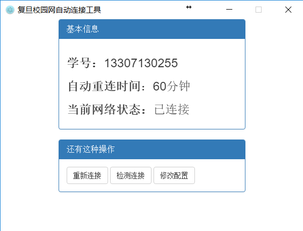
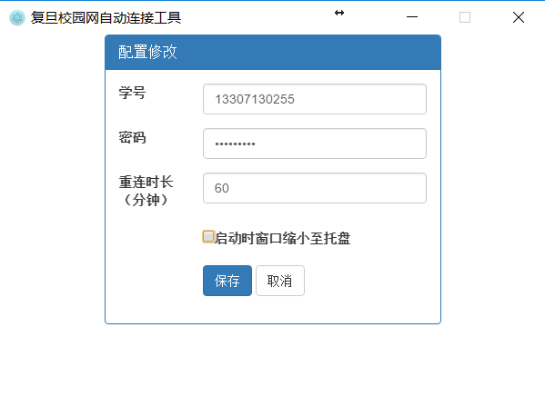

# 复旦有线网自动连接工具  
一款基于electron的定时发送连接请求的复旦校内网络工具
## 下载
windows: https://github.com/linchuming/FudanWebTool/releases/download/1.1/FudanWebTool-v1.1-win32-x64.rar  
linux: https://github.com/linchuming/FudanWebTool/releases/download/1.1/FudanWebTool-v1.1-linux-x64.rar  
## 更新日志
2017.09.21	更新了连接接口，修复无法连接问题
## 使用说明
使用electron运行，release中有完整含electron的版本  

配置文件可以使用UI修改，或者自行修改config.json文件  

点关闭会自动缩小到托盘，程序退出请在托盘处右键点击退出
## 界面
 

